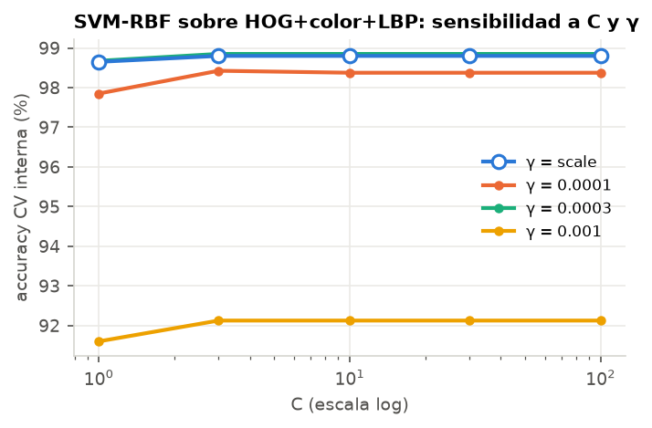
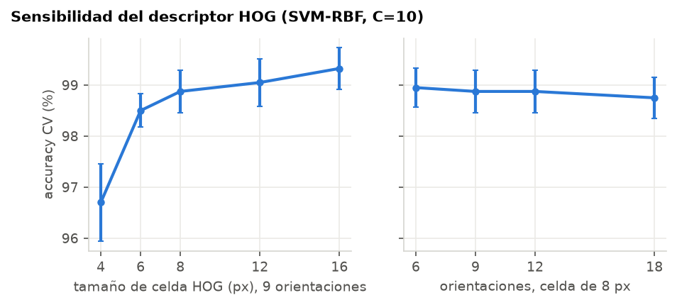
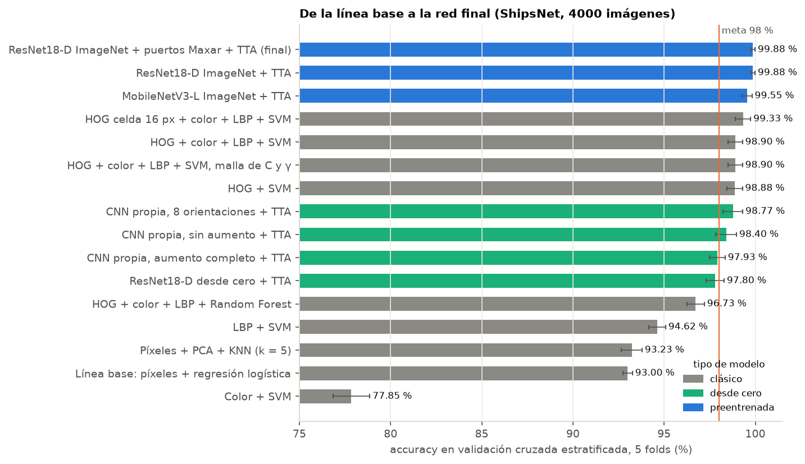
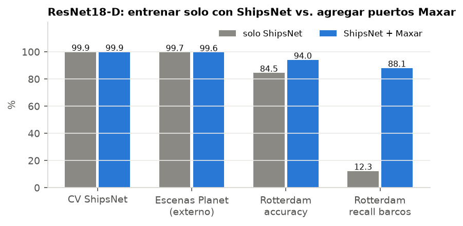
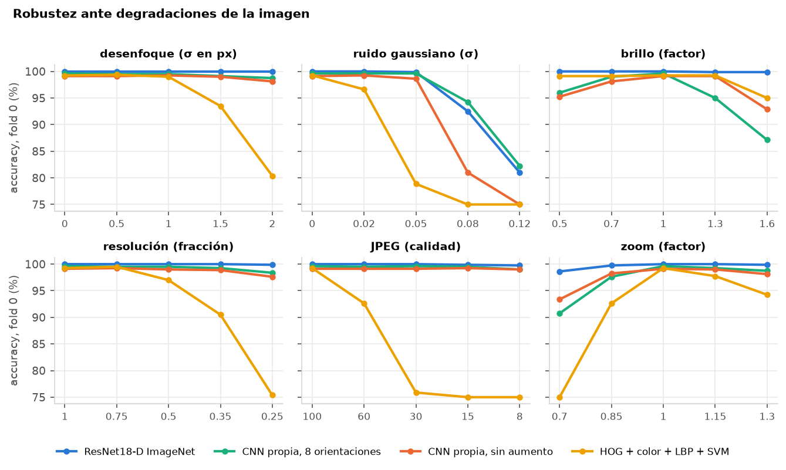
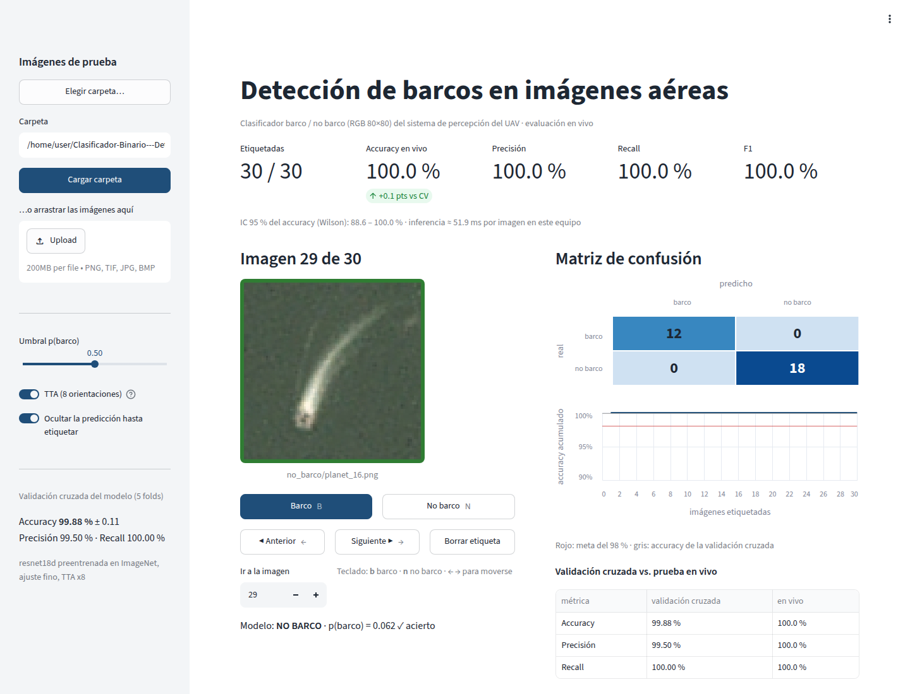

# Informe técnico: clasificador barco / no barco para el UAV de inspección portuaria

Inteligencia Artificial, Ingeniería Mecatrónica, periodo 2026-2. Proyecto 2 (segundo corte). Este documento es la evidencia E2 del formato ABET y describe también el protocolo de la prueba en vivo (E3 y E4).

## 1. Planteamiento

El dron recibe recortes de 80×80 píxeles en RGB y tiene que decidir si en cada uno hay un barco. Dahana y Gurning (2020) proponen la vigilancia aérea precisamente porque el AIS y el VTS muestran la posición de un buque como un ícono, sin la imagen real; el clasificador es la parte que hace esa confirmación visual a bordo, como en las pruebas de inspección con drones del puerto de Rotterdam.

La meta de la asignatura es un accuracy mayor al 98 % sobre un conjunto de prueba que no se conoce de antemano, con una penalización de 0.5 por cada 2 % por debajo. Por eso el trabajo tuvo dos partes. La primera fue optimizar el clasificador sobre ShipsNet con validación cruzada. La segunda, comprobar que el modelo sigue funcionando con imágenes de otros satélites, otras resoluciones y otros puertos, porque nada garantiza que la prueba venga del mismo sensor que el dataset.

## 2. Datos

| Conjunto | Uso | Imágenes | Con barco | Origen |
|---|---|---:|---:|---|
| ShipsNet | entrenamiento y validación cruzada | 4000 | 1000 | Kaggle, PlanetScope a 3 m (bahías de San Francisco y San Pedro) |
| Puertos Maxar | entrenamiento | 1528 | 513 | Maxar Open Data: Valencia, Colombo, Tampa, Kingston (dos fechas), Iskenderun, Durban y Ravenna, remuestreadas a 1.2 m |
| Escenas Planet | prueba externa | 201 | 39 | escenas completas que trae el mismo dataset de Kaggle, recortes nuevos |
| Rotterdam | prueba externa | 322 | 57 | SpaceNet 6, WorldView-2 a 0.5 m llevado a un mosaico de 1 m |

*Tabla 1. Conjuntos de datos. Los tres últimos se armaron para este proyecto.*

En ShipsNet la clase "barco" es una imagen centrada en un único barco completo. La clase "no barco" incluye agua, tierra, muelles, barcos parciales cortados por el borde y confusores que otros modelos marcaban como barco. Los conjuntos nuevos siguen la misma regla: los positivos tienen el barco centrado y completo, ocupando entre el 40 % y el 95 % del lado del recorte; los negativos son ventanas al azar (agua, muelles, grúas, contenedores, zonas urbanas) y barcos cortados por el borde.

Las etiquetas nuevas se hicieron a mano. En Rotterdam los candidatos los propuso un detector YOLOv8 público entrenado con imágenes de Google Earth y cada recorte se revisó a ojo; los dudosos (40) se descartaron. En las escenas de Maxar los barcos se marcaron sobre la imagen con una rejilla de coordenadas y los negativos se revisaron uno por uno para quitar los que tenían algún bote. Las coordenadas de todos los recortes están en `datos_externos/*.json` y `entrenamiento/armar_externos.py` los reconstruye desde las fuentes públicas (se verificó que el resultado es idéntico píxel a píxel).

Las escenas de Planet no son del todo independientes de ShipsNet: son las mismas zonas, y para 28 de los 39 positivos existe en ShipsNet un recorte casi idéntico (similitud coseno mayor a 0.95 entre las imágenes reducidas a 20×20 en gris, probando las 8 orientaciones). Rotterdam sí es independiente: otro sensor, otra resolución, otro puerto y otra época.

## 3. Protocolo de validación

- Validación cruzada estratificada de 5 folds sobre ShipsNet, semilla 42. Todos los modelos (clásicos y redes) usan exactamente los mismos cortes, así que las comparaciones son pareadas.
- Métricas: accuracy, precisión, recall y F1 de la clase barco, y AUC.
- En los recortes de Maxar hay varios recortes del mismo barco a distintas escalas. Para que un mismo barco no quede a la vez en entrenamiento y validación se usa `StratifiedGroupKFold` agrupando por barco.
- Los conjuntos de prueba externa nunca entran al entrenamiento de los modelos que se evalúan. Cada uno de los 5 modelos de la validación cruzada los predice y se reporta el promedio.
- El modelo que usa la interfaz se reentrena al final con todos los datos (incluido Rotterdam). Las cifras de este informe vienen de los modelos de validación, que no vieron los datos con los que se miden.

## 4. Línea base

Antes de optimizar se fijó un punto de partida sin descriptores: cada imagen reducida a 40×40×3 y estandarizada, con regresión logística (C = 0.01). Da 93.00 % ± 0.26 de accuracy. Un KNN (k = 5) sobre las 50 primeras componentes principales llega a 93.23 % ± 0.57. Como referencia, decir "no barco" a todo ya da 75 %, así que la línea base aprende algo, pero está lejos de la meta: solo detecta el 85 % de los barcos (F1 de 0.86).

## 5. Preprocesamiento y descriptores visuales

El preprocesamiento es corto porque ShipsNet ya viene recortado y alineado a 80×80. Para los descriptores, la imagen pasa a gris (HOG y LBP) o a HSV (color), y cada característica se estandariza con la media y la desviación del fold de entrenamiento. Para las redes, los valores se llevan a [0, 1] y se normalizan por canal con la media y la desviación de ImageNet. Las imágenes que no llegan en 80×80, como las de otros sensores, se reescalan con filtro Lanczos.

Se probaron tres descriptores, cada uno con el mismo SVM de kernel RBF (C = 10, γ = scale) para que la comparación dependa solo del descriptor:

- HOG sobre la imagen en gris (celdas de 8 px, 9 orientaciones, bloques de 2×2 con normalización L2-Hys, 2916 valores). Describe la silueta alargada del casco y sus bordes.
- LBP uniforme (P = 8, R = 1): histograma de toda la imagen más uno por cuadrante, 50 valores. Describe textura.
- Color: histogramas HSV de 16 niveles más media y desviación de cada canal RGB, 54 valores.

| Modelo | Tamaño del vector | Accuracy (%) | Precisión (%) | Recall (%) | F1 | AUC |
|---|---:|---:|---:|---:|---:|---:|
| Píxeles 40×40 + regresión logística (línea base) | 4800 | 93.00 ± 0.26 | 87.01 | 84.70 | 0.858 | 0.975 |
| Píxeles + PCA de 50 componentes + KNN (k = 5) | 4800 | 93.23 ± 0.57 | 82.93 | 91.90 | 0.872 | 0.973 |
| Color + SVM | 54 | 77.85 ± 1.01 | 56.83 | 47.80 | 0.518 | 0.843 |
| LBP + SVM | 50 | 94.62 ± 0.46 | 88.69 | 90.00 | 0.893 | 0.982 |
| HOG + SVM | 2916 | 98.88 ± 0.42 | 98.58 | 96.90 | 0.977 | 0.999 |
| HOG + color + LBP + Random Forest (500 árboles) | 3020 | 96.73 ± 0.48 | 96.09 | 90.60 | 0.933 | 0.994 |
| HOG + color + LBP + SVM (C = 10, γ = scale) | 3020 | 98.90 ± 0.40 | 98.48 | 97.10 | 0.978 | 0.999 |
| HOG + color + LBP + SVM con malla de C y γ | 3020 | 98.90 ± 0.40 | 98.48 | 97.10 | 0.978 | 0.999 |

*Tabla 2. Validación cruzada de 5 folds sobre ShipsNet. Precisión, recall y F1 son de la clase barco.*

El HOG solo ya pasa de 93 % a 98.88 %. El color por sí mismo no separa las clases (77.85 %) porque el agua y los barcos cambian de tono entre escenas, y el LBP aporta poco (94.62 %). Juntar los tres descriptores sube apenas a 98.90 %, y un Random Forest sobre el mismo vector queda en 96.73 %.

Para calibrar el SVM se hizo una búsqueda en malla de C ∈ {1, 3, 10, 30, 100} y γ ∈ {scale, 10⁻⁴, 3·10⁻⁴, 10⁻³} con validación cruzada anidada (3 folds internos dentro de cada uno de los 5 externos). La superficie es plana para C ≥ 3 y el único valor claramente malo es γ = 10⁻³, que sobreajusta y cae a 92 % (figura 1). La malla eligió C = 3 en los 5 folds externos, con γ = 3·10⁻⁴ en tres de ellos y γ = scale en dos, y no mejora el valor por defecto: el SVM ya estaba en su techo con estos descriptores. En costo, extraer los tres descriptores toma 4.3 ms por imagen y el SVM 2 ms más en un hilo de CPU.

*Figura 1. Accuracy de la validación interna en función de C y γ. Las curvas de γ = scale y γ = 3·10⁻⁴ casi coinciden.*

La sensibilidad del HOG (figura 2) dio un resultado que no se esperaba: celdas más grandes funcionan mejor. Con celdas de 4 px el SVM llega a 96.70 %, con 8 px (el valor por defecto) a 98.88 % y con 16 px a 99.33 %, usando 576 valores en lugar de 2916. A 80×80 píxeles, un descriptor grueso recoge la forma general del casco y deja por fuera detalles que cambian de una imagen a otra. El número de orientaciones casi no influye: entre 98.75 % y 98.95 % de 6 a 18. Con la celda de 16 px, agregar color y LBP ya no cambia el promedio: la combinación con el mismo SVM también da 99.33 % (± 0.42), el mejor resultado de los métodos clásicos.

*Figura 2. Accuracy en validación cruzada del SVM (C = 10) según el tamaño de celda y el número de orientaciones del HOG.*

Con descriptores clásicos el techo quedó en 99.3 % ± 0.4. Es un margen corto sobre el 98 % para un conjunto de prueba desconocido, y la sección 8 muestra que este tipo de modelo se cae con desenfoque, compresión o baja resolución. Por eso se pasó a redes convolucionales.

## 6. Redes convolucionales

### 6.1 CNN propia

Se diseñó una red pequeña para 80×80: cuatro bloques de dos convoluciones 3×3 con normalización por lotes y ReLU, cada uno seguido de max pooling (80 → 40 → 20 → 10 → 5), con 32, 64, 128 y 256 filtros, pooling global promedio, dropout de 0.3 y una salida sigmoide. Tiene 1.17 millones de parámetros. Se entrenó 25 épocas con AdamW (tasa máxima 2·10⁻³ con política one-cycle), lotes de 64, suavizado de etiquetas de 0.05 y peso 3 para la clase barco, que compensa la proporción 1:3 entre clases.

Con esta red se midió el efecto del aumento de datos en tres niveles: ninguno, solo las 8 orientaciones (rotaciones de 90° y reflejo) y el aumento completo (orientaciones, rotación libre, escala, color, desenfoque, pérdida de resolución y ruido). Con el mismo presupuesto de 25 épocas, el aumento no ayuda dentro de ShipsNet: sin aumento la red llega a 98.92 %, con orientaciones a 98.62 % (98.77 % promediando las 8 vistas al predecir, TTA) y con el aumento completo a 97.42 %. Con más variación en los datos la red necesita más épocas: en una corrida de control sobre el fold 0, la accuracy de validación de la red con aumento completo seguía subiendo al final (91.9 % en la época 5, 96.8 % en la 20 y 98.0 % en la 25). El TTA sí depende del aumento: a la red entrenada sin rotaciones le baja el accuracy (de 98.92 % a 98.40 %), porque nunca vio barcos en esas orientaciones.

### 6.2 Transferencia desde ImageNet

La otra opción fue partir de redes preentrenadas en ImageNet con la librería timm. La principal es una ResNet18-D (11.2 millones de parámetros), la variante de ResNet de He et al. (2019) que reemplaza la convolución con paso 2 del atajo por un promedio, ajustada 12 épocas con tasa máxima de 10⁻³ y el aumento completo. Para separar el efecto del preentrenamiento del de la arquitectura, la misma red se entrenó también desde cero con idéntica configuración. Con la misma receta se ajustó una MobileNetV3-L (Howard et al., 2019), de 4.2 millones de parámetros y diseñada para equipos móviles, para ver cuánto se pierde con una red más liviana.

| Red (validación cruzada, 5 folds) | Parámetros | Accuracy (%) | Accuracy con TTA (%) | F1 con TTA | Escenas Planet (%) | Rotterdam (%) | Recall Rotterdam (%) |
|---|---:|---:|---:|---:|---:|---:|---:|
| CNN propia, sin aumento | 1.17 M | 98.92 ± 0.45 | 98.40 ± 0.57 | 0.969 | 98.5 | 84.1 | 10.2 |
| CNN propia, 8 orientaciones | 1.17 M | 98.62 ± 0.58 | 98.77 ± 0.54 | 0.976 | 98.6 | 83.4 | 6.3 |
| CNN propia, aumento completo | 1.17 M | 97.42 ± 0.50 | 97.93 ± 0.42 | 0.960 | 95.8 | 84.5 | 13.3 |
| ResNet18-D desde cero | 11.2 M | 97.93 ± 0.50 | 97.80 ± 0.49 | 0.958 | 95.9 | 83.1 | 6.0 |
| ResNet18-D preentrenada en ImageNet | 11.2 M | 99.75 ± 0.21 | 99.88 ± 0.11 | 0.998 | 99.7 | 84.5 | 12.3 |
| MobileNetV3-L preentrenada en ImageNet | 4.2 M | 99.15 ± 0.25 | 99.55 ± 0.27 | 0.991 | 98.6 | 83.5 | 7.0 |

*Tabla 3. Redes entrenadas solo con ShipsNet. Las tres últimas columnas son prueba externa y se comentan en la sección 7.*

El preentrenamiento es lo que más pesa. La misma ResNet18-D pasa de 97.93 % desde cero a 99.75 % preentrenada, y a 99.88 % con TTA: de unos 17 errores en cada fold de 800 imágenes a 1. Con 4000 imágenes la red no alcanza a aprender filtros tan buenos como los que ya trae de ImageNet (bordes, texturas, formas alargadas). La MobileNetV3-L preentrenada también supera a todas las redes entrenadas desde cero (99.55 % con TTA), pero comete 18 errores en las 4000 imágenes, contra 5 de la ResNet18-D, cuyo peor fold con TTA queda en 99.75 %.

*Figura 3. Accuracy en validación cruzada de todas las configuraciones, con su desviación entre folds. La línea naranja marca la meta del 98 %.*

## 7. Generalización a otro sensor y otro puerto

Con 99.88 % en validación cruzada el problema parecía resuelto, pero la prueba externa de Rotterdam mostró otra cosa. La ResNet18-D entrenada solo con ShipsNet reconoce el 12 % de los barcos de Rotterdam; su accuracy de 84.5 % sale casi entero de acertar los "no barco", que son el 82 % del conjunto. Ninguna de las redes entrenadas solo con ShipsNet llega al 14 % de recall en Rotterdam, mientras que en las escenas de Planet todas superan el 95 %.

La explicación está en los datos. ShipsNet tiene una sola fuente: PlanetScope a 3 m en dos bahías de California. A esa resolución un buque es una mancha clara y alargada sobre agua oscura. En WorldView a 1 m el mismo buque llena el recorte y muestra detalles que la red nunca vio: contenedores de colores, grúas, sombras y el muelle al lado. La red aprendió a reconocer barcos tal como se ven en las imágenes de Planet, y esa apariencia no se traslada a otro sensor.

Para corregirlo se agregaron al entrenamiento los 1528 recortes de los puertos de Maxar, sin tocar Rotterdam, que siguió siendo solo de prueba. En la validación cruzada los recortes de Maxar se reparten en 5 folds agrupados por barco, en paralelo con los folds de ShipsNet.

| ResNet18-D ImageNet, TTA | Solo ShipsNet | ShipsNet + puertos Maxar |
|---|---:|---:|
| Validación cruzada ShipsNet (%) | 99.88 | 99.88 |
| Validación cruzada puertos Maxar, por barco (%) | no aplica | 98.82 |
| Escenas Planet, prueba externa (%) | 99.7 | 99.6 |
| Rotterdam, accuracy (%) | 84.5 | 94.0 |
| Rotterdam, precisión (%) | 100.0 | 80.3 |
| Rotterdam, recall (%) | 12.3 | 88.1 |

*Tabla 4. Promedio de los 5 modelos de la validación cruzada. En Rotterdam hay 57 barcos y 265 recortes sin barco.*

Con los puertos de Maxar el accuracy en ShipsNet no cambia (99.88 %) y en Rotterdam pasa de 84.5 % a 94.0 %, con el 88 % de los barcos detectados. En los propios recortes de Maxar, validados por barco, el accuracy es 98.82 %. Los errores que quedan en Rotterdam son de dos tipos: pontones y muelles flotantes que la red toma por barcos (la precisión en Rotterdam es 80 %) y filas de barcazas fluviales amarradas una junto a otra, que el modelo no reconoce como barco.

*Figura 4. Efecto de agregar imágenes de otros puertos al entrenamiento de la ResNet18-D. Rotterdam no se usó para entrenar ninguno de los dos modelos.*

## 8. Robustez ante la cámara del dron

Una cámara embarcada no entrega siempre la misma imagen. Hay desenfoque por vibración o movimiento, ruido del sensor, cambios de iluminación, compresión para transmitir el video y cambios de altura que alteran la escala del barco. Para medir cuánto afecta cada factor, los modelos se entrenaron con los folds 1 a 4 de ShipsNet y se evaluaron sobre el fold 0 con la perturbación aplicada (tabla 5 y figura 5). Como el fold tiene 25 % de barcos, un 75 % de accuracy equivale a responder "no barco" a todo.

| Perturbación | Nivel | ResNet18-D ImageNet | CNN propia, 8 orientaciones | CNN propia, sin aumento | HOG + color + LBP + SVM |
|---|---|---:|---:|---:|---:|
| Ninguna | | 100.0 | 99.6 | 99.1 | 99.3 |
| Desenfoque gaussiano | σ = 2 px | 100.0 | 98.8 | 98.1 | 80.4 |
| Ruido gaussiano | σ = 0.05 | 99.9 | 99.6 | 98.6 | 78.9 |
| Ruido gaussiano | σ = 0.08 | 92.5 | 94.3 | 81.0 | 75.0 |
| Brillo | ×0.5 | 100.0 | 96.0 | 95.3 | 99.1 |
| Brillo | ×1.6 | 99.9 | 87.1 | 92.9 | 95.0 |
| Resolución | 1/4 (20×20 px reescalado) | 99.9 | 98.4 | 97.6 | 75.4 |
| Compresión JPEG | calidad 8 | 99.8 | 99.0 | 99.0 | 75.0 |
| Zoom | ×0.7 (barco más pequeño) | 98.6 | 90.8 | 93.4 | 75.0 |
| Zoom | ×1.3 | 99.9 | 98.8 | 98.1 | 94.3 |

*Tabla 5. Accuracy (%) en el fold 0 de ShipsNet bajo cada perturbación. El detalle completo está en `resultados/robustez.csv`.*

El SVM con descriptores es el más frágil. Con desenfoque de 2 px, compresión JPEG de calidad 30 o menos, o la resolución reducida a una cuarta parte, cae a 75–80 %: el HOG depende de bordes finos y esas degradaciones los borran. La ResNet18-D, que tuvo desenfoque, ruido, pérdida de resolución y cambios de color en el aumento de datos, se mantiene por encima de 98.6 % en todas las pruebas salvo con ruido fuerte (σ = 0.08, un 8 % del rango de intensidad), donde baja a 92.5 %. Las CNN propias, entrenadas sin cambios de color, pierden hasta 12 puntos cuando el brillo sube 60 %. Esta comparación mezcla el efecto del preentrenamiento con el del aumento de datos, pero deja claro que la combinación elegida aguanta las degradaciones que puede traer la cámara del dron, con la excepción del ruido muy alto.

*Figura 5. Accuracy en el fold 0 bajo cada perturbación.*

## 9. Costo de inferencia para el dron

El computador de un dron tiene mucho menos cómputo que una estación de trabajo, así que el costo de cada red cuenta. Las redes se exportaron a ONNX y se midió el tiempo de inferencia con ONNX Runtime usando un solo hilo de CPU (Intel Xeon a 2.1 GHz), para una imagen y para las 8 vistas del TTA.

| Red | Parámetros | ONNX (MB) | ms por imagen | ms con TTA (8 vistas) | Accuracy CV (%) |
|---|---:|---:|---:|---:|---:|
| CNN propia | 1.17 M | 4.7 | 5.0 | 38.5 | 98.92 (sin TTA) |
| MobileNetV3-L ImageNet | 4.2 M | 16.8 | 1.7 | 9.4 | 99.55 |
| ResNet18-D ImageNet (modelo final) | 11.2 M | 44.8 | 6.0 | 45.5 | 99.88 |

*Tabla 6. Mediana de 200 ejecuciones. La ResNet18-D es el archivo `modelo/barcos.onnx` que usa la interfaz. El accuracy de las redes preentrenadas es con TTA.*

La ResNet18-D final tarda 6 ms por imagen en un solo hilo (unas 160 imágenes por segundo) y 45 ms con las 8 vistas del TTA (22 por segundo). Para confirmar recortes que ya marcó un detector o el AIS alcanza de sobra. Si el dron tuviera que barrer escenas completas con una ventana deslizante hay dos salidas: quitar el TTA, que en la validación cruzada solo sube el accuracy de 99.75 % a 99.88 %, o pasar a MobileNetV3-L, que es 3.5 veces más rápida pero se equivoca más (99.55 % con TTA). La CNN propia tiene menos parámetros pero no es más rápida, porque sus primeras capas trabajan a la resolución completa de 80×80.

## 10. Modelo final

La red elegida es una ResNet18-D preentrenada en ImageNet (pesos de la librería timm), ajustada con ShipsNet, los puertos de Maxar y Rotterdam: 5850 imágenes, 1570 con barco. Se entrenó 12 épocas con AdamW (tasa máxima 10⁻³ con política one-cycle, decaimiento de pesos 10⁻⁴), lotes de 64, suavizado de etiquetas de 0.05 y peso de la clase barco igual a la razón negativos/positivos para compensar el desbalance. El aumento de datos combina las 8 orientaciones de 90° y reflejo, rotación libre de ±45°, escala entre 0.85 y 1.2, desplazamiento, cambios de color (saturación, balance de blancos, contraste, brillo y gamma), desenfoque, pérdida de resolución y ruido.

El modelo se exportó a ONNX y la interfaz lo corre con ONNX Runtime, así que el computador de la prueba (o el del dron) no necesita PyTorch. En la inferencia se promedian las 8 orientaciones de cada imagen (TTA) y se usa umbral 0.5 sobre p(barco). Antes de exportar se verificó que ONNX y PyTorch dan la misma salida (diferencia máxima de 8·10⁻⁸ en la probabilidad).

Las métricas que muestra la interfaz (guardadas en `modelo/info.json`) son las de esta misma configuración en la validación cruzada: 99.88 % ± 0.11 de accuracy en ShipsNet, con precisión de 99.50 % y recall de 100 %. Los 5 errores en las 4000 imágenes son falsos positivos, y los cinco son casos límite del criterio de ShipsNet: barcos cortados por el borde del recorte y una embarcación pequeña con su estela, etiquetados como "no barco". Dos de ellos quedan con p(barco) de 0.54 y 0.55, casi en el umbral.

## 11. Prueba en vivo (E3 y E4)

La interfaz (`app.py`) sigue este flujo:

1. Se cargan las imágenes de la carpeta de prueba (por defecto `test/`; también se puede escoger otra o arrastrar archivos). Las imágenes que no son de 80×80 se reescalan y la interfaz lo avisa.
2. El modelo clasifica todo el lote al cargar. Con la opción "Ocultar la predicción hasta etiquetar" activada, quien etiqueta no ve la salida del modelo antes de decidir.
3. Cada imagen se etiqueta con los botones o con las teclas `b` y `n`; las flechas ← y → sirven para moverse entre imágenes. Si los archivos ya traen la etiqueta en el nombre (formato de ShipsNet) o en subcarpetas `barco/` y `no_barco/`, se pueden usar directamente.
4. Con cada etiqueta se recalculan accuracy, precisión, recall y F1, la matriz de confusión y la curva de accuracy acumulado. El accuracy lleva un intervalo de confianza de Wilson al 95 %.
5. Para el contraste con la validación cruzada la interfaz muestra una tabla con ambas columnas y revisa si el accuracy de la validación cruzada cae dentro del intervalo de confianza en vivo. Si queda por encima, hay indicios de que las imágenes de prueba difieren de las de entrenamiento (sensor, escala o criterio de etiquetado) y en la galería se pueden filtrar las imágenes con error para ver cuáles fallaron.
6. "Guardar evaluación" deja en `resultados_en_vivo/` un CSV con la predicción, la probabilidad y la etiqueta de cada imagen, y un JSON con la matriz de confusión y las métricas.

*Figura 6. Interfaz al terminar de etiquetar las 30 imágenes de `muestras/`.*

El intervalo de confianza importa para interpretar el resultado. Con 100 imágenes y 98 aciertos, el intervalo de Wilson va de 93.0 % a 99.4 %, así que una diferencia de uno o dos puntos frente a la validación cruzada no alcanza para decir que el modelo empeoró.

## 12. Limitaciones

- La definición de clase pesa mucho. En ShipsNet un barco cortado por el borde cuenta como "no barco"; si en la prueba se etiqueta como "barco" cualquier imagen donde se vea parte de un barco, el modelo va a discrepar en esos casos por diseño.
- Las etiquetas de Rotterdam y de Maxar las hizo una sola persona. En Rotterdam quedaron casos discutibles (pontones y muelles flotantes, filas de barcazas amarradas) que explican buena parte de los errores restantes.
- Los botes pequeños (lanchas, veleros de marina) no se incluyeron como barco en los datos nuevos, siguiendo ShipsNet, que está hecho para buques.

## Referencias

- Dahana, U. y Gurning, R. O. S. (2020). Maritime Aerial Surveillance: Integration Manual Identification System to Automatic Identification System. IOP Conference Series: Earth and Environmental Science, 557, 012014.
- Hammell, R. Ships in Satellite Imagery (ShipsNet). Kaggle: https://www.kaggle.com/datasets/rhammell/ships-in-satellite-imagery
- The Maritime Executive. Rotterdam tests drones for ship inspections and monitoring the port: https://maritime-executive.com/article/rotterdam-tests-drones-for-ship-inspections-and-monitoring-the-port
- Shermeyer, J. et al. (2020). SpaceNet 6: Multi-Sensor All Weather Mapping Dataset. CVPR Workshops.
- Maxar Open Data Program, catálogo de eventos: https://maxar-opendata.s3.amazonaws.com/events/catalog.json
- Dalal, N. y Triggs, B. (2005). Histograms of Oriented Gradients for Human Detection. CVPR.
- Ojala, T., Pietikäinen, M. y Mäenpää, T. (2002). Multiresolution gray-scale and rotation invariant texture classification with local binary patterns. IEEE TPAMI, 24(7).
- He, K., Zhang, X., Ren, S. y Sun, J. (2016). Deep Residual Learning for Image Recognition. CVPR.
- He, T. et al. (2019). Bag of Tricks for Image Classification with Convolutional Neural Networks. CVPR (variante ResNet-D).
- Howard, A. et al. (2019). Searching for MobileNetV3. ICCV.
- Wightman, R. PyTorch Image Models (timm): https://github.com/huggingface/pytorch-image-models
